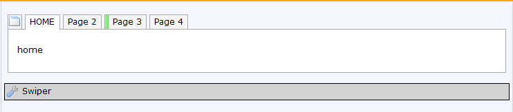

# Swipeable Tabs 📱

Full-width, swipeable tabs, like Whatsapp or Venmo, complete with animations, and swipe-to-change-tab

### Installation

1. Install the widget in your project
2. Include the **Swiper** widget on a page as a sibling of a tab container you'd like to display as full-width
    
3. Configure the widget:

+ `Active Marker Color` : CSS color for the active-marker (the little slidey bar)
+ `Show Pagination` : Set to **No** to hide the tab headers. Useful if you want to just have users swipe between tabs as "pages"
+ `Tabs Background Color` : CSS color for the background of the tabs. defaults to `whitesmoke`
+ `Tabs Class (To Add)` : a class name to add to the tab headers `ul` 

### Styling

Classes to Override:

`.swiper-pagination-bullet-active` is the active tab header.

`.swiper-pagination-bullet` is each tab header (each `li` in the `ul` that can be styled by `Tabs Class (To Add)` above)

### Typical usage scenario

- When a mobile app has multiple pages and you'd prefer a swipeable tab menu to act as the main navigation

### Known Limitations

+ Doesn't behave well with large numbers of tabs ☹️

###### Based on the Mendix Widget Boilerplate

See [AppStoreWidgetBoilerplate](https://github.com/mendix/AppStoreWidgetBoilerplate/) for an example
